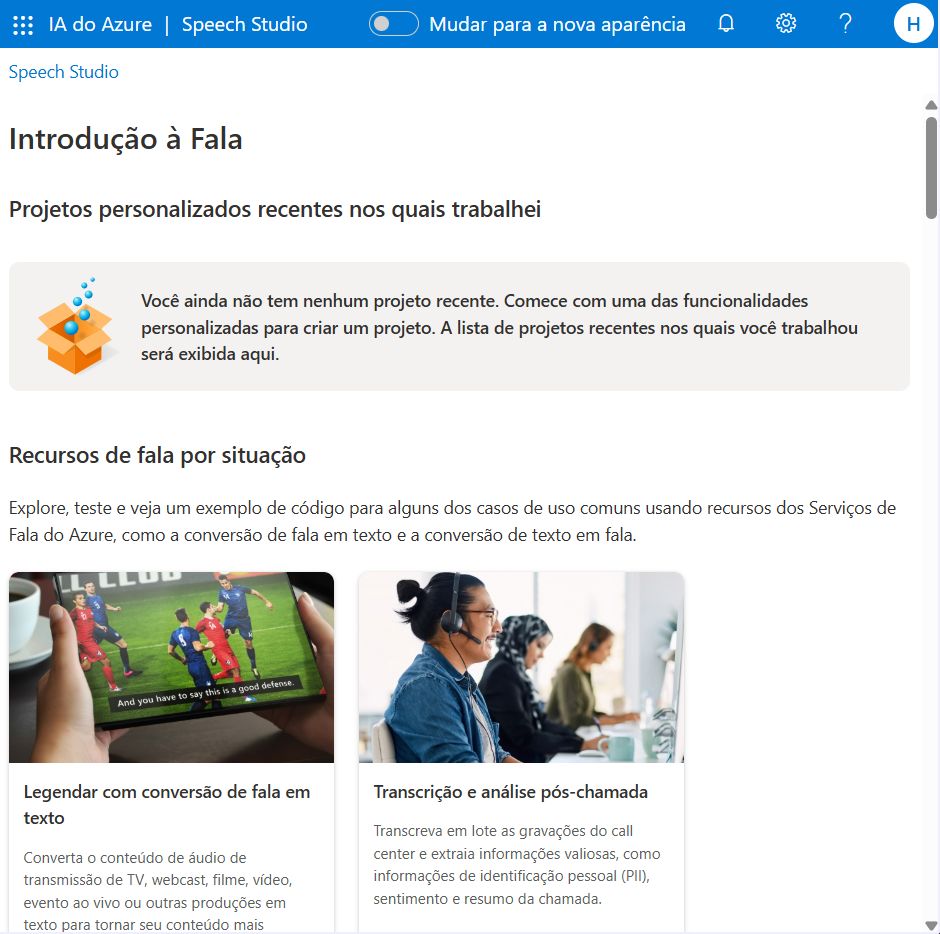
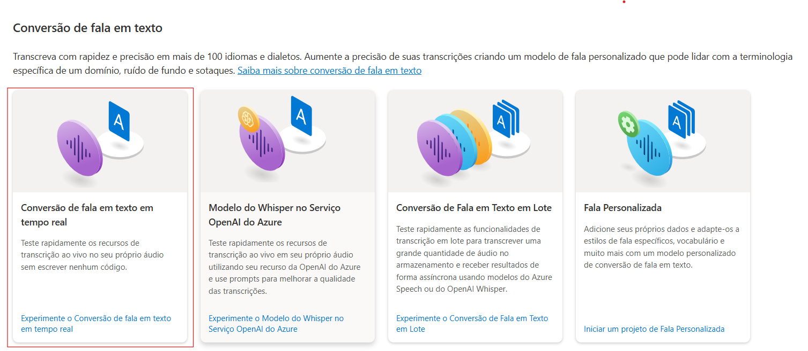
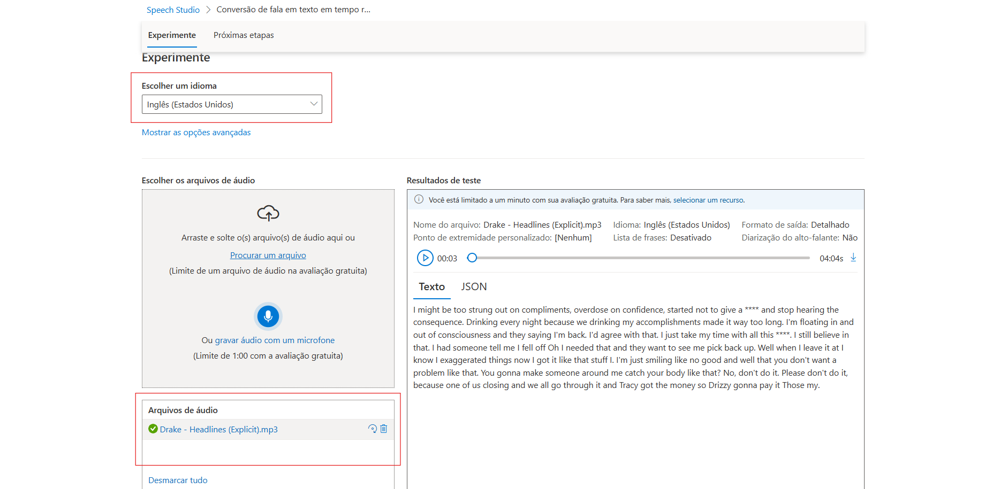
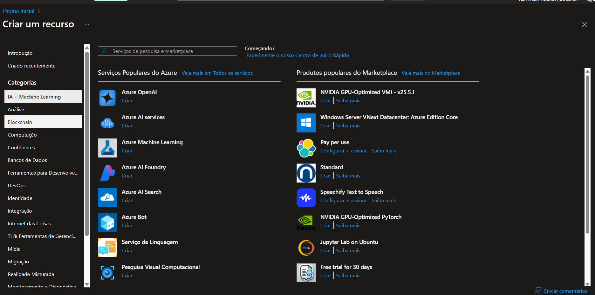
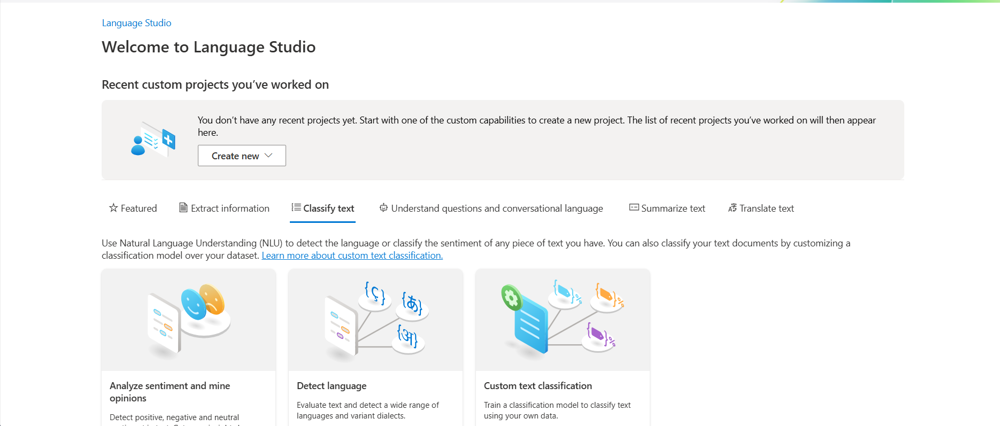
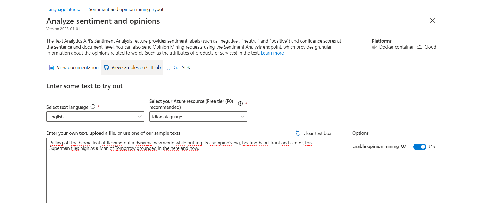
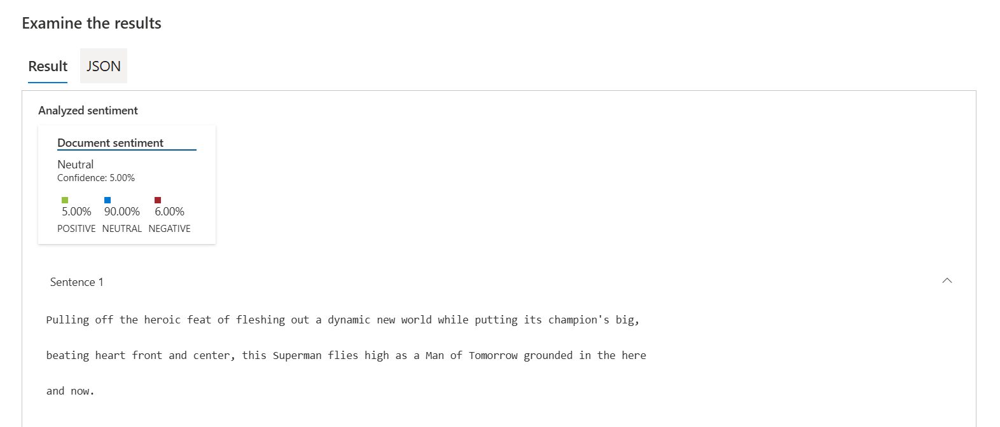

# Análise de Sentimentos com Language Studio no Azure AI

## Introdução
Pratica de ferramentas para análise de fala e linguagem natural, utilizando o Azure Speech Studio e Language Studio da Microsoft.

## 💻Ferramentas utilizadas
Azure Speech Studio e Language Studio.

## ⚒️Passo a Passo do projeto
 ✅ Configuração do Speech Studio
 
 1- Acesse o [Azure Speech Studio](https://speech.microsoft.com/portal).

 2- Faça login com a conta [Microsoft](https://www.microsoft.com/pt-br/) vinculada ao Azure.

 3- Crie um novo projeto de fala (Speech project) com o tipo de funcionalidade desejada (por exemplo: transcrição de fala, texto para fala, etc).

 4- Configure o idioma principal (por exemplo: Português - Brasil).

 5- Vincule o projeto a uma chave de recurso (Azure Key) e a uma região (Azure Region) válidas, previamente criadas no portal do Azure.

## Criação de modelos utilizando o Azure Speech Studio
- Primeiramente nos cadastramos e utilizamos o site Azure Speech Studio

  

- Encontramos a seção de conversão de fala em texto e selecionamos o recursos de conversão de fala em texto em tempo real.

  

- Dentro do modelo configuramos para utilizar o modelo, escolhemos o idioma que iremos utilizar, que nesse caso foi o inglês (Estados Unidos) e escolhe o arquivo de áudio.

  

- Nesse caso utilizamos o áudio da música do cantor Drake chamada [Headlines](https://www.youtube.com/watch?v=cimoNqiulUE&list=RDcimoNqiulUE&start_radio=1), logo apos importa o arquivo de áudio o modelo ira transcreve-lo em texto.

## Criação de modelos utilizando o Laguage Studio

- Primeiramente iremos ao [Portal Azure](https://portal.azure.com/#home) e criaremosum recurso para utilizar no [Laguage Studio](https://language.cognitive.azure.com/home), onde selecionamos IA e Machine Learning.

- Logo apos iremos encontrar selecionar para criar um serviço de liguagem, que iremos criar para utilizar no recurso que criaremos no Laguage Studio.

  

- Depois de criar, iremos para o [Laguage Studio](https://language.cognitive.azure.com/home) e selecionaremos para utilizar a ferramenta de analise de sentimento e opinião 

  

- Logo apos iremos configurar a ferramenta para ser utilizada, escolhendo o idioma, selecionando o recurso que criamos anteriormente e carregando o texto que deve ser analisado.

   

 - No teste utilizei um resumo da crítica do [Rotten Tomatoes](https://www.rottentomatoes.com/) sobre o filne Superman, os resultados podem ser observados logo a baixo:

   

 - Podemos observar que segundo a analise realizada, a critica demostra um sentimento neutro sobre o filme.

 ## Desafios
- Alguns desafios encontrados foram o entendimento de algumas funcionalidades ou a utilização das ferramentas em projetos no dia a dia.

## Referencias
- [Explore Speech Studio](https://microsoftlearning.github.io/mslearn-ai-fundamentals/Instructions/Labs/09-speech.html) - Laboratório no Microsoft Learning
- [Analyze text with Language Studio](https://microsoftlearning.github.io/mslearn-ai-fundamentals/Instructions/Labs/06-text-analysis.html) - Laboratório no Microsoft Learning

